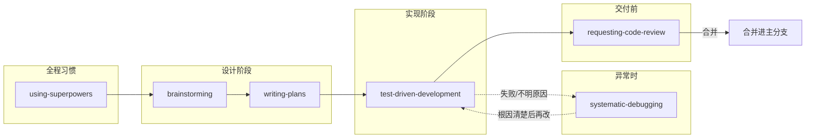

# Superpowers 技能说明（本地 `.cursor/skills`）

本文说明仓库内以下六个技能各自的用途、使用时机与衔接关系。内容依据各目录下的 `SKILL.md`。

| 路径 | 技能名 |
|------|--------|
| `.cursor/skills/using-superpowers` | using-superpowers |
| `.cursor/skills/brainstorming` | brainstorming |
| `.cursor/skills/writing-plans` | writing-plans |
| `.cursor/skills/test-driven-development` | test-driven-development |
| `.cursor/skills/requesting-code-review` | requesting-code-review |
| `.cursor/skills/systematic-debugging` | systematic-debugging |

---

## 典型工作流（做新功能）

1. **using-superpowers**：先知道「何时该加载其他 skill」及优先级规则。
2. **brainstorming**：把想法聊成设计，并得到你明确批准。
3. **writing-plans**：把设计拆成可执行的小任务计划（动手改代码前）。
4. **test-driven-development**：按计划红 → 绿 → 重构实现。
5. **requesting-code-review**：在关键节点做代码评审（见该 skill 的「必做」场景）。
6. **systematic-debugging**：出现 bug、测试失败或异常行为时，先根因再修复。

---

## 从需求到合并（总流程）

**习惯：** 接到任何任务时，用 **using-superpowers** 先判断该不该加载别的 skill（不必每条消息都打 `@`，复杂任务开头 @ 一次即可）。

**主路径（新功能）：** 设计获批后再写计划，再 TDD 实现；出事用系统化调试；合并前做评审。
brainstorming（设计获批）→ writing-plans（计划）→ test-driven-development（按计划红绿重构写）→ 必要时 systematic-debugging（卡住或失败时）→ requesting-code-review（合分支前 / 大步骤后）

**TDD 与 systematic-debugging 谁先？**

- **原因不明、不可稳定复现**：先用 **systematic-debugging**，避免猜改。
- **行为已清楚、要写新逻辑或防回归**：用 **test-driven-development**（先失败测试再实现）。

**只修 bug：** 以 **systematic-debugging** 为主；修完若要进主分支，再走 **requesting-code-review**。若采用 TDD 修 bug，在根因清楚后补失败用例再改代码。

---

## 1. using-superpowers（总开关 / 用法）

**作用：** 约定只要任务有哪怕很小概率适用某个 skill，就应先加载它；并说明 skill 与系统默认行为的冲突时，以 **用户明确指令**（如 `AGENTS.md`、直接说的话）为最高优先级。

**何时用：** 会话开始时或不确定该走哪条流程时，作为元规则参考。

**要点：** 若 skill 内含 checklist，应按条执行；不同 IDE/CLI 加载 skill 的方式以各平台文档及本 skill 内说明为准。

---

## 2. brainstorming（头脑风暴 → 设计）

**作用：** 在写代码之前，通过对话澄清需求、约束与成功标准；给出 **2～3 种方案、取舍与推荐**；形成可评审的设计。

**何时用：** 新功能、新组件、改行为、加能力等创造性工作。skill 强调即使看似简单也要走流程（可缩短，但不能跳过「呈现设计并获批准」）。

**硬门槛：** 在用户 **明确批准设计之前**，不得调用实现类 skill、不得写代码、不得脚手架。

**产出约定：** 设计文档可保存至 `docs/superpowers/specs/YYYY-MM-DD-<topic>-design.md`（以 `SKILL.md` 为准）。

**衔接：** 设计通过后应进入 **writing-plans**，而不是直接跳到其他实现类 skill。

---

## 3. writing-plans（写实施计划）

**作用：** 在已有 spec 或需求的前提下，写 **假设执行者几乎不了解本仓库** 也能照做的实施计划：涉及文件、测试方式、小步提交等。原则包括 DRY、YAGNI、TDD、频繁 commit。

**何时用：** 多步骤任务、**触碰代码之前**。

**产出约定：** `docs/superpowers/plans/YYYY-MM-DD-<feature-name>.md`（若项目或用户另有约定路径，以用户为准）。

**任务粒度：** 每一步应是短动作（约 2～5 分钟级），例如：写失败测试 → 运行确认失败 → 最小实现通过 → 跑全测 → commit。

---

## 4. systematic-debugging（系统化调试）

**作用：** 避免「猜改」：必须先完成 **根因调查**，再谈修复；未完成调查阶段则不应给出修复方案。

**何时用：** 测试失败、线上 bug、行为异常、性能、构建失败、集成问题等；时间越紧、越像「一眼能修」越适用，以减少返工。

**流程要点：** 按 skill 中的阶段顺序执行（例如：读全错误信息、稳定复现、对照近期变更、多组件时在边界收集证据等）。

---

## 5. requesting-code-review（请求代码评审）

**作用：** 在合适节点发起 **专注在产物上的评审**（向子代理/评审方提供精简上下文，而非整段会话历史）。

**何时用（skill 中的「必做」示例）：** 子代理驱动开发中每个任务后、大功能完成后、合并进 main 前；也可在卡住、大重构前、复杂 bug 修复后使用。

**实践提示：** 准备改动范围（如 base/head 提交或等价信息），按 `SKILL.md` 中的模板填写描述与需求/计划引用，并按严重程度处理反馈。

---

## 6. test-driven-development（TDD）

**作用：** 严格执行 **先写失败测试 → 确认失败符合预期 → 写最少生产代码通过 → 重构**；核心是 **未先观察到测试失败，则无法确认测的是正确行为**。

**何时用：** 新功能、修 bug、重构、行为变更；例外需与负责人（人类）约定。

**铁律：** **没有「先红」就不要写生产代码**；若已先写实现，应按 skill 要求回到测试先行（不要保留「参考用」的生产代码旁路）。

---

## 在 Cursor 中如何使用

- **@ 引用：** 在对话中 `@.cursor/skills/<目录名>`，明确让助手按该 skill 执行。
- **自然语言：** 例如「按 `writing-plans` 写实施计划」「按 `systematic-debugging` 分析这个报错」。
- **如何自检是否生效：** 观察回复是否符合该 skill 的固定要求（例如 `writing-plans` 会声明正在使用该 skill、产出计划路径与细粒度任务；`brainstorming` 在批准前不应直接改代码）。

---

## 维护说明

若通过 `npx skills add obra/superpowers@<name>` 更新了全局技能，可将 `~/.agents/skills/<name>` 同步复制到本仓库 `.cursor/skills/<name>`，并视需要更新本文中与路径或流程相关的段落。
